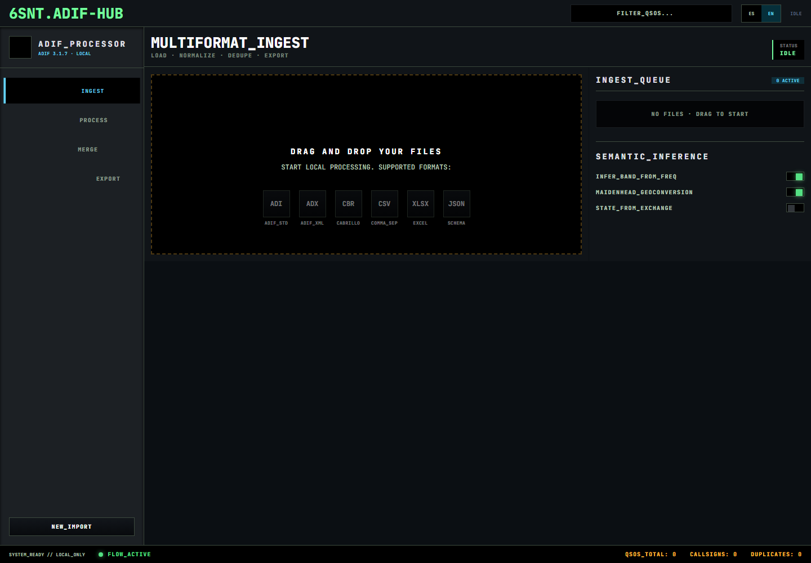

# 6SNT.ADIF-HUB

**Local-first ADIF cleanup hub for ham radio operators.**

[](LICENSE)
[](CHANGELOG.md)
[](SECURITY.md)

6SNT.ADIF-HUB helps radio amateurs turn scattered log exports into a clean,
reviewable ADIF file. Import logs, normalize fields, detect duplicates, resolve
conflicts and export a consolidated `.adi` without sending your logbook to a
cloud service.

> Work first with copies of your logs. Do not test beta software against your
> only master log.



**Start here:** [Manual ES](docs/manual/es/GUIA_USUARIO.md) ·
[English manual](docs/manual/en/USER_GUIDE.md) ·
[Quickstart ES](docs/manual/es/GUIA_RAPIDA.md) ·
[Quickstart EN](docs/manual/en/QUICK_START.md)

## What Is It?

6SNT.ADIF-HUB is not a daily logger. It does not replace LoTW, eQSL, ClubLog,
QRZ, Log4OM, N1MM or your main logging workflow.

It is a local preparation hub for operators who need to clean, consolidate and
export log data safely before using other tools or online platforms.

## What Problem Does It Solve?

Many operators have logs spread across contests, portable activations,
spreadsheets, exported ADIF files and old logger backups. Mixing those files
directly into a master log can create duplicate QSOs, inconsistent fields and
hard-to-review conflicts.

6SNT.ADIF-HUB gives you a staging cockpit for:

- scattered `ADI`, `ADX`, `Cabrillo`, `CSV`, `TSV`, `XLSX` and `JSON` logs;
- column mapping and ADIF normalization;
- duplicate candidates and conflict review;
- safer exports before touching the master log.

## Supported Workflows

1. Import one or more log files.
2. Normalize common fields toward ADIF 3.1.7 conventions.
3. Review column mapping when the source file is ambiguous.
4. Deduplicate QSOs with contextual rules.
5. Resolve conflicts by strategy or field selection.
6. Export a consolidated `ADI` file for manual review and downstream tools.

Supported format families:

| Input | Notes |
| --- | --- |
| `ADI` | ADIF text exports |
| `ADX` | ADIF XML exports |
| `Cabrillo` / `CBR` | Contest logs with supported templates and generic fallback |
| `CSV` / `TSV` | Spreadsheet-style tabular exports |
| `XLSX` | Local spreadsheet parsing via `openpyxl` |
| `JSON` | Structured local exports |

## Privacy / Local-First

- Files are processed on your machine.
- The working database is local SQLite.
- There is no cloud login or external sync in the current design.
- Use copies and subsets during beta testing.
- Do not publish real logs, private ADIF exports, SQLite databases or sensitive
  screenshots in issues or pull requests.

See [Security Policy](SECURITY.md) and
[Privacy and local data](docs/manual/en/PRIVACY_AND_LOCAL_DATA.md).

## Documentation

- [Documentation index](docs/INDEX.md)
- [Manual espanol](docs/manual/es/GUIA_USUARIO.md)
- [English manual](docs/manual/en/USER_GUIDE.md)
- [Guia rapida ES](docs/manual/es/GUIA_RAPIDA.md)
- [Quickstart EN](docs/manual/en/QUICK_START.md)
- [FAQ ES](docs/marketing/FAQ_PRELANZAMIENTO_ES.md)
- [FAQ EN](docs/marketing/PRELAUNCH_FAQ_EN.md)
- [Privacidad y datos locales ES](docs/manual/es/PRIVACIDAD_Y_DATOS_LOCALES.md)
- [Privacy and local data EN](docs/manual/en/PRIVACY_AND_LOCAL_DATA.md)
- [Contributing](CONTRIBUTING.md)
- [Changelog](CHANGELOG.md)

## Current Status

Current state: beta/MVP. The main import, mapping, normalization,
deduplication, conflict review and export flow is implemented.

Known limitations:

- uncommon contest layouts may need new Cabrillo templates;
- ADX support covers simple XML and does not yet perform full XSD validation;
- unusual spreadsheet layouts can require manual preparation;
- inferred state/zone data is intentionally conservative;
- every exported ADIF should be reviewed before upload to external services.

## Screenshots

Current sanitized screenshots live in [`assets/screenshots`](assets/screenshots):

- [English UI](assets/screenshots/adif-hub-en.png)
- [Spanish UI](assets/screenshots/adif-hub-es.png)

The root `screen.png` is kept only as an older visual reference and should not be
used as the public product screenshot.

## For Ham Operators

Use 6SNT.ADIF-HUB when you want to clean up logs before they reach the place you
trust most. Keep your original exports untouched, test with a copy, review every
conflict that matters, and only then export a new ADIF for your normal logbook or
online services.

The app does not control radios, key PTT, transmit audio, send CW or automate
station operation.

## For Developers

Project structure:

```text
backend/     FastAPI pipeline, parsers, SQLite persistence and tests
frontend/    React + TypeScript + Vite + Tailwind UI
docs/        ES/EN manuals, validation, distribution and product notes
assets/      Public screenshots, banner placeholders and icons
scripts/     Local build/documentation helper scripts
sample_logs/ Fictional sample logs for demos and manual testing
```

Backend:

```powershell
cd backend
python -m venv .venv
. .\.venv\Scripts\Activate.ps1
pip install -r requirements-dev.txt
uvicorn app.main:app --reload
```

Frontend:

```powershell
cd frontend
npm install
npm run dev
```

Open `http://127.0.0.1:5173`.

Validation:

```powershell
cd backend
.\.venv\Scripts\python -m pytest
.\.venv\Scripts\ruff check app tests
```

```powershell
cd frontend
npm run build
```

The frontend currently has no `lint` script.

## Packaging

The Windows desktop build script is:

```powershell
pwsh -File scripts\build_exe.ps1
```

This generates local build artifacts under ignored folders such as `dist_exe/`
and `build_exe/`. Do not commit generated binaries. Public releases should be
published only after explicit release approval.

